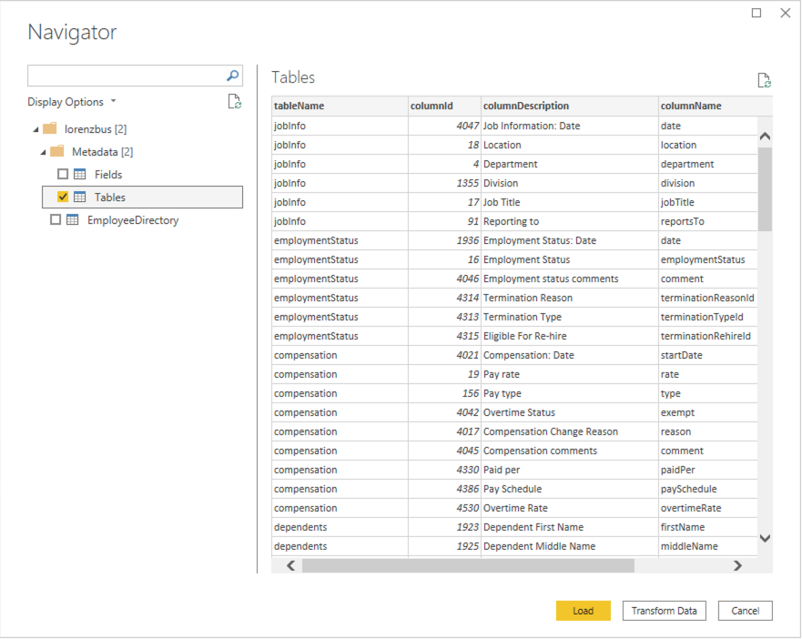

# BambooHrPQExtension
Power Query connector for BambooHR.

## Installation

- Copy the extension file (`BambooHrPQExtension.mez`) into [Documents]/Power BI Desktop/Custom Connectors.
- Check the option **(Not Recommended) Allow any extension to load without validation or warning** in Power BI Desktop (under File | Options and settings | Options | Security | Data Extensions).
- Restart Power BI Desktop.

## Usage

- Open Power BI
- Select File | Get Data
- Select `Other`, `BambooHrPQExtension`, then `Connect`

- When the dialog appears, supply the `subdomain`:

- Select the desired tables from the Navigator dialog

## Contributors

- [Craig Buchanan](https://github.com/craibuc/)

## References

- [BambooHR API reference](https://documentation.bamboohr.com/reference)
- [Power Query documentation](https://docs.microsoft.com/en-us/power-query/)
- [Power Query samples](https://docs.microsoft.com/en-us/power-query/samplesdirectory)
- [Ben Gribaudo's Power Query M Primer](https://bengribaudo.com/blog/2017/11/17/4107/power-query-m-primer-part1-introduction-simple-expressions-let)
- [Chris Webb's BI Blog - Custom Data Connectors](https://blog.crossjoin.co.uk/category/custom-data-connectors/)
